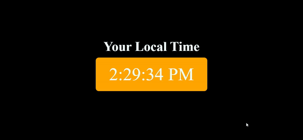

# Digital Clock

A simple web application that displays the current time in a digital clock format. This project is built using HTML, CSS, and JavaScript, and is designed to help practice core JavaScript concepts such as `setInterval`, `Date()`, and DOM manipulation.

## Features

- **Real-Time Display**: Shows the current time and updates every second.
- **Simple Design**: Clean and minimalistic interface.

## Technologies Used

- **HTML**: Structure the web page.
- **CSS**: Style the web page.
- **JavaScript**: Implement the clock functionality and handle real-time updates.

## Demo

Check out the live demo [here](https://amrit-sharma-7.github.io/Clock/).



## Project Structure

```plaintext
digital-clock/
├── index.html
├── styles.css
└── main.js
```

- **index.html**: Contains the HTML structure for the digital clock.
- **styles.css**: Contains the CSS styles for the digital clock.
- **main.js**: Contains the JavaScript code for updating the clock in real time.

## Key JavaScript Concepts Practiced

- **setInterval**: Execute a function at regular intervals to update the clock every second.
- **Date()**: Retrieve the current date and time.
- **DOM Manipulation**: Access and update HTML elements to display the current time.

## Acknowledgments

- This project was created to practice JavaScript concepts and improve web development skills.

---
